# Contents

- [Contents](#contents)
- [Structure](#structure)
- [Rows](#rows)
- [Deletion and padding](#deletion-and-padding)
- [Gaps between rows](#gaps-between-rows)
- [Implementation](#implementation)

# Structure

First, we have a fixed-size `<div>` that displays `maxDisplayedRows` rows at a time and
scrolls when its content overflows. This is our "window" through which we
see a part of the list

Next, we have a second `<div>` inside. That `<div>` has height `rows.length * rowHeightPx` - that is, it takes up entire space needed to show the whole list

Since the second `<div>` usually has many more rows than we see at a time,
it causes the first `<div>` to overflow and scroll. Scrollbar size is
the same as when we would render the entire list at once

```jsx
<div :style="{
    height: 'auto',
    maxHeight: props.maxDisplayedRows * props.rowHeightPx,
    overflowY: 'scroll'
}">
  <div :style="{ height: props.rows.length * props.rowHeightPx }">
    <!-- rows -->
  </div>
</div>
```

Note that we set `maxHeight`, not `height`, for the first `<div>`. In case
our list has fewer than `maxDisplayedRows` rows, the first `<div>` will
have smaller height

Then, we add a fixed amount of rows inside of the second `<div>`. These rows
display list items in such way the it looks as if we scroll through the list:

# Rows

Initially we show first `maxDisplayedRows` rows

We also keep `overscanRows` (2 in the example) before and after the window -
this way only row nodes outside the window are removed/added, before the user
even sees them. Because of that, the row node would already be in DOM by the
time user should see it and the browser should render it. This leads to
visually smoother scroll

Let's say we have 10 rows in total, `maxDisplayedRows=3`, `overscanRows=2`,
and height of one row is `50px`

In DOM, we will have these rows (indices mean indices of the items in the list):

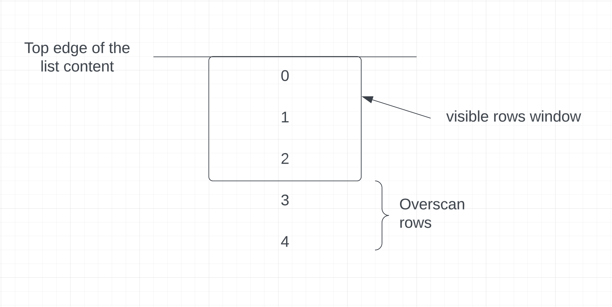

After scrolling down by one item it will look like this:

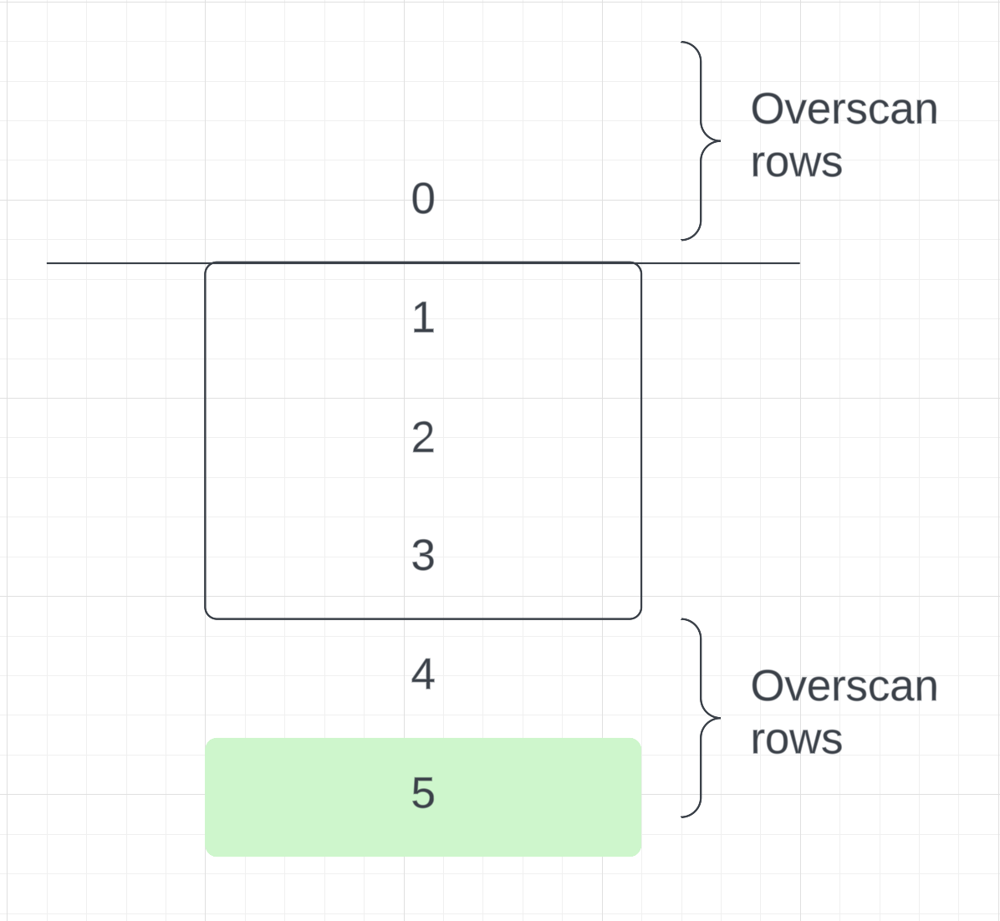

Notice that item `5` was added. After scrolling again:

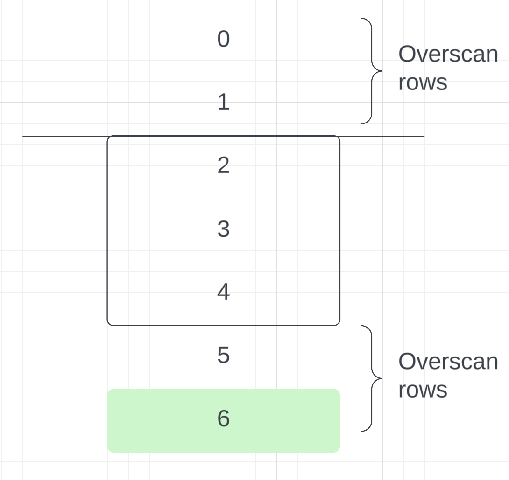

After scrolling again, we get:

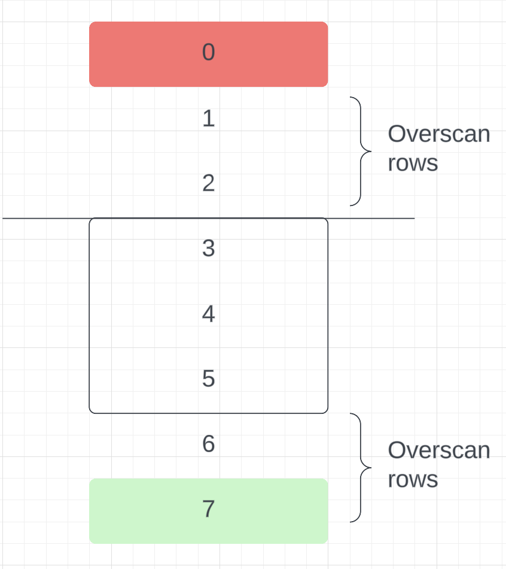

Notice how `0` was deleted - we keep at most 2 overscan rows. When scrolling,
we keep adding and removing rows like that:

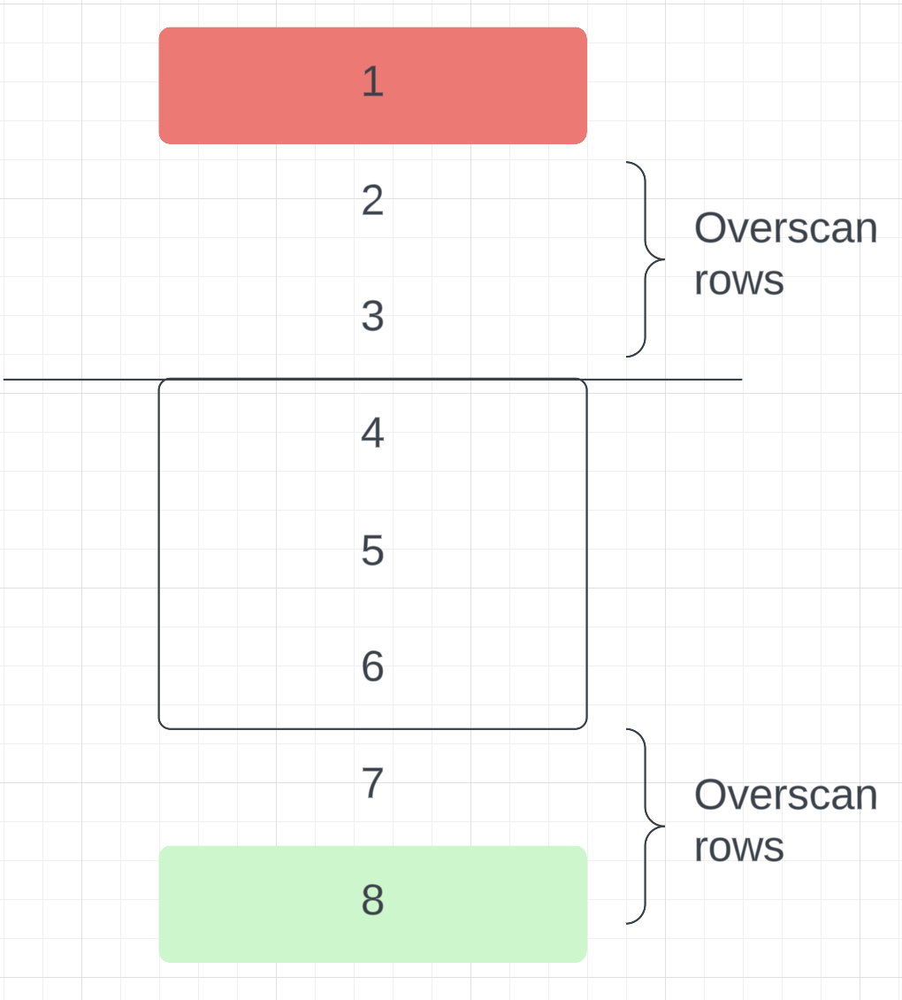
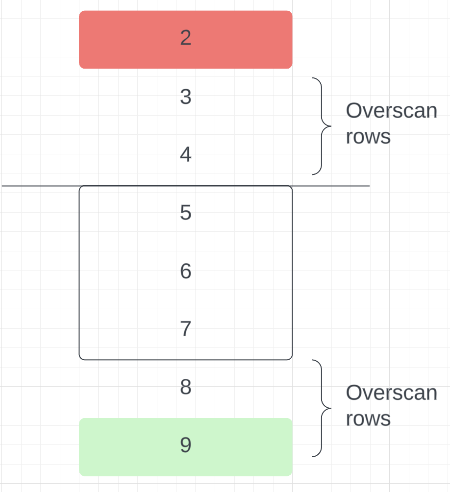
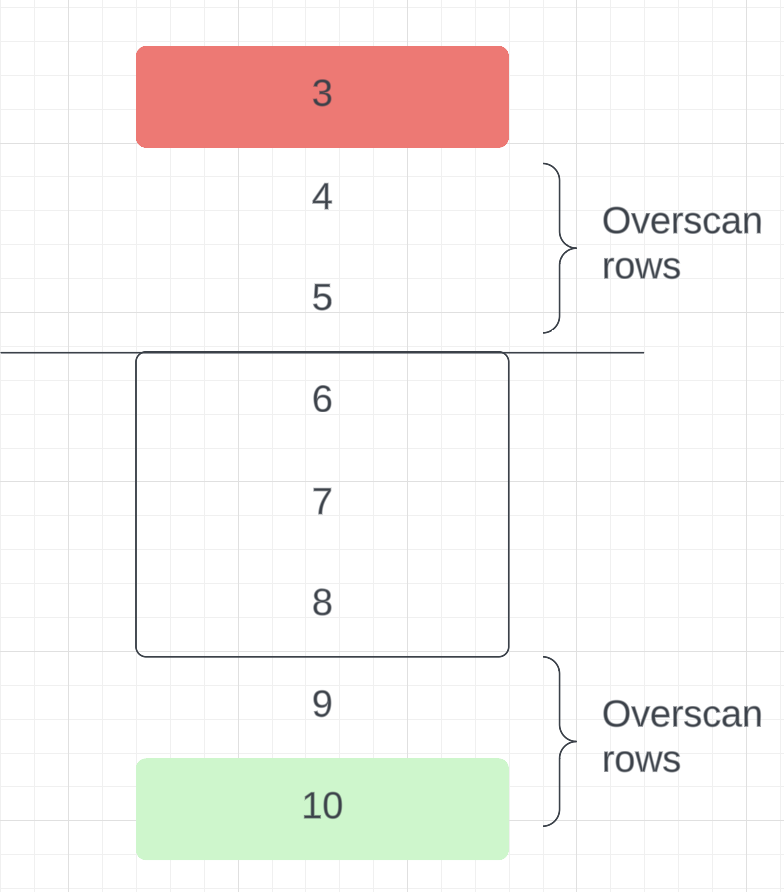

Once we reach the end of the list (remember, we have 10 rows in total), we
stop adding overscan rows at the bottom, and simply remove overscan rows at
the top:

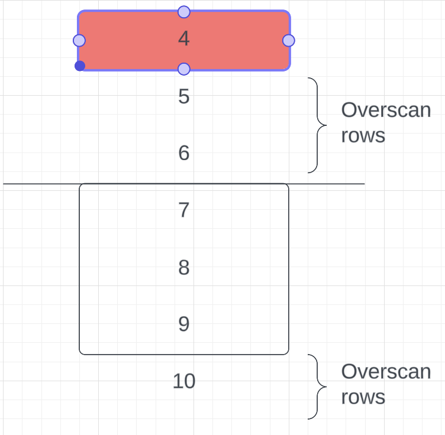

And so on

# Deletion and padding

Let's look at the this moment of scrolling:

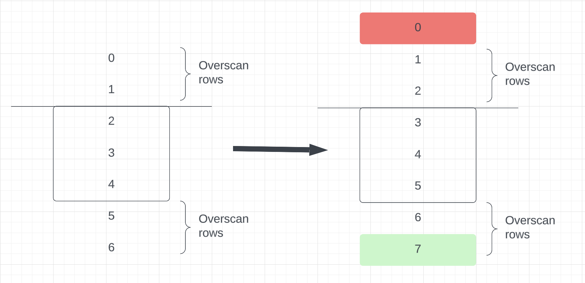

Before the scroll, `scrollTop` of the the first `<div>` was `100px`, since
there are 2 rows before the top edge of the displayed part of the div,
and each row is `50px` in height:

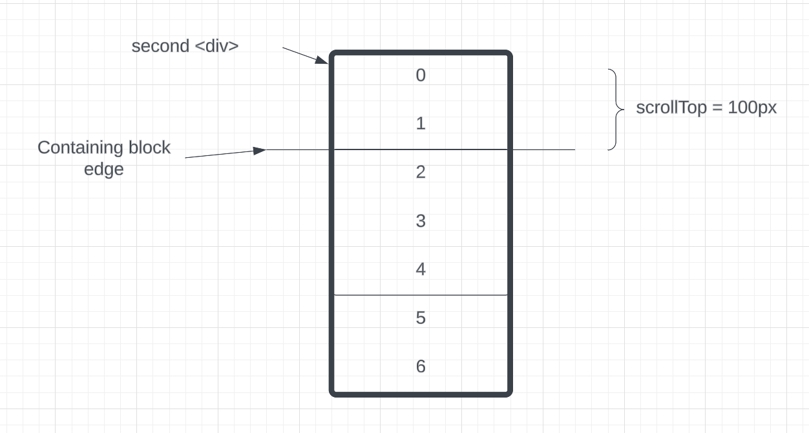

The scrollbar would look like below. We have 10 rows in total, 50px each,
so total content height is 500px. We have scrolled past 2 rows, so the
scroll thumb is at 100px

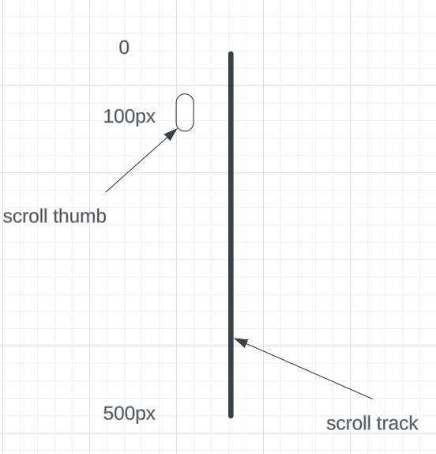

After we scroll down by one row, we essentially scroll by 50px. `scrollTop`
would become `150px`. Remember that we also delete row `0`, so now row `1`
is the first in the container

Since row `1` is the first in the container, it would start at offset 0px.
Row `2` would start at offset `50px`, row `3` - at offset `100px`, and so on

As a result, we would see wrong rows in the window (recall from the screenshot
above the we should see rows 3, 4, 5, but we see 4, 5, 6 instead)

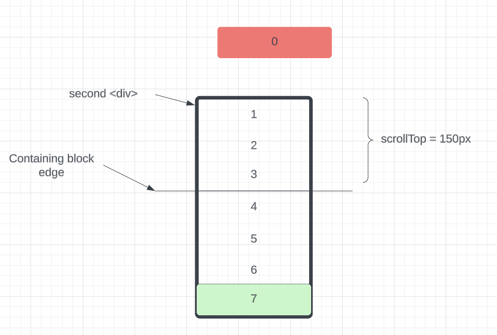

To fix that, we compensate the space that row `0` was occupying before deletion.
We do that by adding `paddingTop` to the second `div`. It's value will be
the height of row `0`:

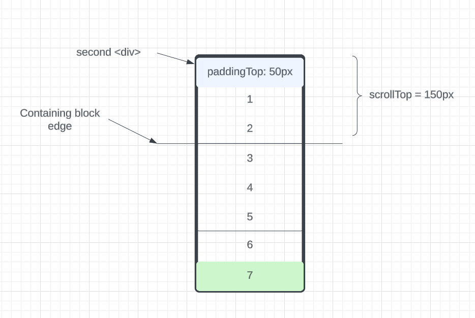

When we scroll again and remove row `1`, we add another `50px` to the padding,
so it's `100px` in total:

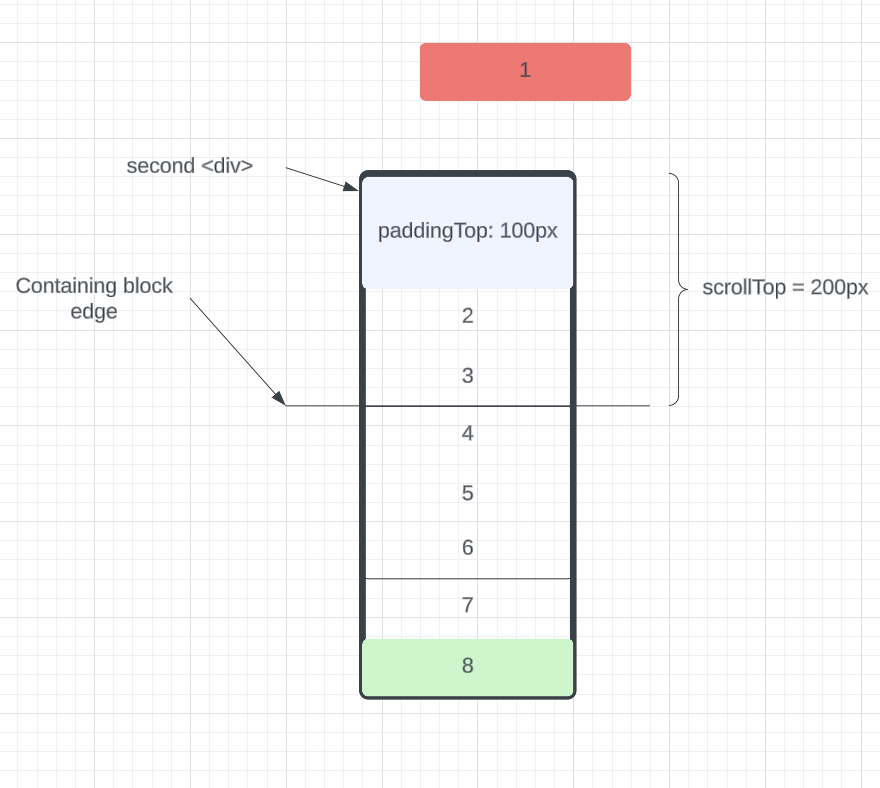

If the index of the first row in the DOM is `firstRowIndex`, we can compute
`paddingTop` as

```
paddingTop = firstRowIndex * rowHeightPx
```

# Gaps between rows

Another complication is adding gaps between rows. Virtualization algorithm
works as above, but replace `rowHeightPx` with `pxPerRow = rowHeightPx + rowGapPx`

# Implementation

The list implemented like this:

We track `scrollTop` of the first `<div>` into a reactive variable
(we use custom hook `useScrollTop()` for that)

Based on `scrollTop` and `pxPerRow`, `maxDisplayedRows` and `overscanRows`
we can compute:

`firstRowIndex` - index of the first row in the DOM
`lastRowIndex` - index of the last row in DOM

(see the code for the details how it's done)

Then we generate array of numbers from `firstRowIndex` to `lastRowIndex`:

```
firstRowIndex = 0
lastRowIndex = 6
displayedIndices = [0, 1, 2, 3, 4, 5, 6]
```

Finally, we render the many rows using v-for:

```vue
<div v-for="displayedIndex in displayedIndices" :key="displayedIndex">
    <slot :row="rows[displayedIndex]"></slot>
</div>
```
